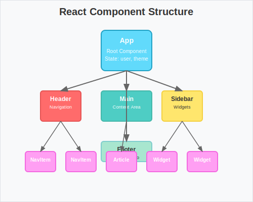

# React Development

[[React]] is a powerful library for building user interfaces, especially single-page applications. It's part of the broader [[JavaScript Frameworks]] ecosystem and has become one of the most popular choices for frontend development.

## Core Concepts


*How React components are organized in a typical application*

### Components
React applications are built using components - reusable pieces of UI:

```jsx
function Welcome(props) {
  return <h1>Hello, {props.name}</h1>;
}
```

### JSX
JSX allows you to write HTML-like syntax in JavaScript:

```jsx
const element = <h1>Hello, world!</h1>;
```

### State and Props
- **Props** - Data passed down from parent components
- **State** - Internal component data that can change
- **Hooks** - Modern way to manage state and side effects

## Key Features

- **Virtual DOM** - Efficient updates
- **Component Lifecycle** - Understanding when components mount, update, and unmount
- **Event Handling** - Responding to user interactions
- **Conditional Rendering** - Showing/hiding elements based on state

## Learning Path

1. **Understand [[JavaScript]] fundamentals**
2. **Learn [[HTML and CSS]] for styling**
3. **Start with React basics** - components and JSX
4. **Explore state management** - useState, useEffect
5. **Build projects** to practice
6. **Learn [[API Development]]** for data fetching

## Ecosystem

React has a rich ecosystem:

- **[[Node.js]]** - For backend development
- **[[Database Design]]** - Data storage
- **[[Performance Optimization]]** - React optimization techniques
- **[[Static Site Generators]]** - Documentation and blogs

## Advanced Topics

- **Context API** - Global state management
- **Redux** - Predictable state container
- **React Router** - Client-side routing
- **Testing** - Unit and integration tests

## Resources

- [[React Documentation]] - Official React guide
- [[MDN Web Docs]] - JavaScript reference
- [[FreeCodeCamp]] - Interactive tutorials
- [[Stack Overflow]] - Community help

## Related Topics

- [[Web Development Journey]] - My learning path
- [[JavaScript Frameworks]] - Framework comparison
- [[API Development]] - Backend integration
- [[Mobile Development]] - React Native

---

*React has transformed how I think about building user interfaces, making development more modular and maintainable.*
