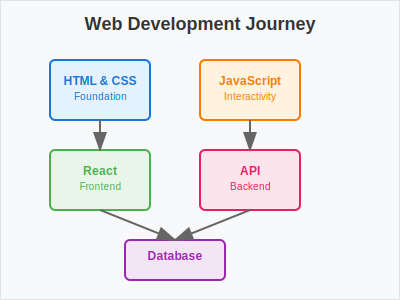

# Visual Learning Guide

[[Visual Learning Guide]] demonstrates how to use images and diagrams to enhance your [[Web Development Journey]]. Visual elements make complex concepts easier to understand.

## Web Development Path

Here's a visual representation of the typical web development learning path:


*Figure 1: The progression from HTML/CSS through JavaScript to frameworks and databases*

This diagram shows how [[HTML and CSS]] form the foundation, leading to [[JavaScript]], then branching into [[React Development]] and [[API Development]], ultimately connecting to [[Database Design]].

## React Component Structure

Understanding [[React]] components is much easier with visual diagrams:


*Figure 2: How React components are organized in a typical application*

This diagram illustrates:
- **App Component** - The root component managing global state
- **Header, Main, Sidebar** - Layout components
- **Footer** - Bottom section
- **Child Components** - Specific functionality components

## Learning with Visuals

### Benefits of Visual Learning

1. **Faster Comprehension** - Images process 60,000x faster than text
2. **Better Retention** - Visual memory is more reliable
3. **Pattern Recognition** - Easier to see relationships
4. **Reduced Cognitive Load** - Less mental effort required

### Types of Visual Content

#### Screenshots
Capture real examples of your work:
```markdown

```

#### Diagrams
Show relationships and flow:
```markdown

```

#### Code Examples
Visualize code structure:
```markdown

```

## Creating Your Own Visuals

### Tools for Diagrams

- **Draw.io** - Free online diagram tool
- **Lucidchart** - Professional diagramming
- **Figma** - Design and prototyping
- **Miro** - Collaborative whiteboarding

### Screenshot Tools

- **Snipping Tool** (Windows)
- **Screenshot** (macOS)
- **Greenshot** (Cross-platform)
- **Lightshot** (Quick screenshots)

### Image Optimization

- **Compress images** - Use tools like TinyPNG
- **Choose right format** - PNG for diagrams, JPEG for photos
- **Responsive sizing** - Ensure images work on all devices

## Integration with Your Learning

### In [[Web Development Journey]]

Add visual milestones to track progress:

```markdown

*My progress through different technologies*
```

### In [[React Development]]

Document component patterns:

```markdown

*Common React component patterns I've learned*
```

### In [[Database Design]]

Visualize data relationships:

```markdown

*User authentication database design*
```

## Best Practices

### Image Organization

```
content/images/
├── diagrams/          # Flow charts and diagrams
├── screenshots/       # Application screenshots
├── code-examples/    # Code structure visuals
├── progress/         # Learning progress charts
└── icons/           # Technology logos and icons
```

### Naming Conventions

- Use descriptive names: `react-component-hierarchy.svg`
- Include version numbers: `database-schema-v2.png`
- Use kebab-case: `web-development-path.png`

### Accessibility

- Always include alt text for images
- Use descriptive captions
- Ensure color contrast for diagrams
- Provide text alternatives for complex visuals

## Related Topics

- [[Working with Images in Quartz]] - Technical implementation
- [[Web Development Journey]] - Your learning path
- [[React Development]] - Component visualization
- [[Database Design]] - Schema diagrams

## Resources

- [[MDN Web Docs]] - Web image optimization
- [[FreeCodeCamp]] - Visual learning techniques
- [[Stack Overflow]] - Image handling questions

---

*Visual learning transforms abstract concepts into concrete understanding, making your [[Web Development Journey]] more effective and enjoyable.*
